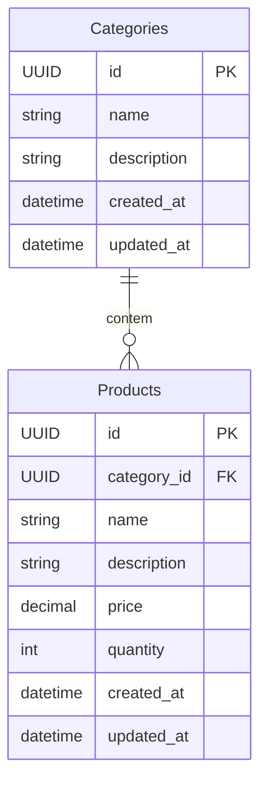

# Desafio Técnico

notes: 
- como é algo pequeno não vou usar pinia,redux e etc para gerenciamento de estado global

obs: estou desenvolvendo no codespace do github, caso tenha problema com a api troque a url base para a adequeda do backend no arquivo `frontend/composables/apiConfig.ts` na variavel `urlBase`

## Comandos para startar o projeto como dev

#### backend
- docker - rodando sqllite3
```bash
    cd backend
    
    docker-compose up -d

    dotnet run
```

#### frontend
```bash
    cd frontend

    npm install

    npm run dev
```

## Modelagem dos dados



## Endpoints da API

### 🏷️ Categorias (`api/categories`)

| Método  | Rota               | Descrição                              |
|---------|--------------------|----------------------------------------|
| `GET`   | `api/categories`      | Lista todas as categorias              |
| `POST`  | `api/categories`      | Cria uma nova categoria                |
| `GET`   | `api/categories/{id}` | categorias por id                      |
| `PUT`   | `api/categories/{id}` | Atualiza uma categoria                 |
| `DELETE`| `api/categories/{id}` | Remove uma categoria                   |


### 📦 Produtos (`api/products`)


| Método  | Rota                                 | Descrição                    |
|---------|--------------------------------------|------------------------------|
| `GET`   | `api/products`                       | Lista todos os produtos      |
| `GET`   | `api/products/{id}`                  | Obtém um produto por ID      |
| `GET`   | `api/products/category/{categoryId}` | Lista produtos por categoria |
| `POST`  | `api/products`                       | Cria um novo produto         |
| `PUT`   | `api/products/{id}`                  | Atualiza um produto          |
| `DELETE`| `api/products/{id}`                  | Remove um produto            |

## Interface

como o vuetify tem seus componentes vou me basear em 3 telas
1. Home - mostrar as categorias
    - vai conter os cards de categoria com a possibilidade de editar
    - filtro simples com botão para criar nova categoria
    - um botão para acessar todas os produtos
2. List - mostrar os produtos
3. Produto - mostras as informações geral do produto e sua categoria
    - mostra as informações de um produto especifico (ler,editar,apagar)
    - criar um produto novo para as categorias registradas