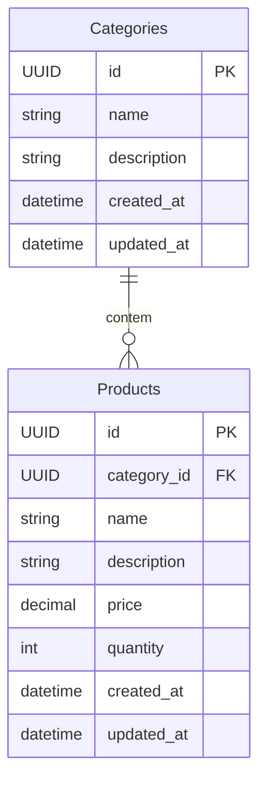

# Desafio Técnico

notes: 

## Comandos para startar o projeto como dev

#### backend
- docker - rodando sqllite3
```bash
    cd backend
    
    docker-compose up -d

    dotnet run
```

#### frontend
```bash
    cd frontend

    npm install

    npm run dev
```

## Modelagem dos dados



## Endpoints da API

### 🏷️ Categorias (`api/categories`)

| Método  | Rota               | Descrição                              |
|---------|--------------------|----------------------------------------|
| `GET`   | `api/categories`      | Lista todas as categorias              |
| `POST`  | `api/categories`      | Cria uma nova categoria                |
| `GET`   | `api/categories/{id}` | categorias por id                      |
| `PUT`   | `api/categories/{id}` | Atualiza uma categoria                 |
| `DELETE`| `api/categories/{id}` | ⚠ Remove uma categoria e seus produtos |


### 📦 Produtos (`api/products`)

Método	Rota	Descrição
GET	api/products	Lista todos os produtos
GET	api/products/{id}	Obtém um produto por ID
GET	api/products/category/{categoryId}	Lista produtos por categoria
POST	api/products	Cria um novo produto
PUT	api/products/{id}	Atualiza um produto
DELETE	api/products/{id}	Remove um produto

| Método  | Rota                                 | Descrição                    |
|---------|--------------------------------------|------------------------------|
| `GET`   | `api/products`                       | Lista todos os produtos      |
| `GET`   | `api/products/{id}`                  | Obtém um produto por ID      |
| `GET`   | `api/products/category/{categoryId}` | Lista produtos por categoria |
| `POST`  | `api/products`                       | Cria um novo produto         |
| `PUT`   | `api/products/{id}`                  | Atualiza um produto          |
| `DELETE`| `api/products/{id}`                  | Remove um produto            |