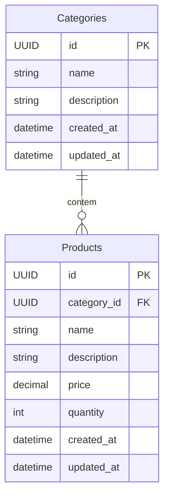

# Desafio Técnico

notes: 

## Comandos para startar o projeto como dev

#### backend
- docker - rodando sqllite3
```bash
    cd backend
    
    docker-compose up -d

    dotnet run
```

#### frontend
```bash
    cd frontend

    npm install

    npm run dev
```

## Modelagem dos dados



## Endpoints da API

### 🏷️ Categorias (`/categories`)

| Método  | Rota               | Descrição                              |
|---------|--------------------|----------------------------------------|
| `GET`   | `/categories`      | Lista todas as categorias              |
| `POST`  | `/categories`      | Cria uma nova categoria                |
| `PUT`   | `/categories/{id}` | Atualiza uma categoria                 |
| `DELETE`| `/categories/{id}` | ⚠ Remove uma categoria e seus produtos |


### 📦 Produtos (`/products`)

| Método  | Rota             | Descrição                  |
|---------|------------------|----------------------------|
| `GET`   | `/products`      | Lista todos os produtos    |
| `POST`  | `/products`      | Cria um novo produto       |
| `PUT`   | `/products/{id}` | Atualiza um produto        |
| `DELETE`| `/products/{id}` | Remove um produto          |